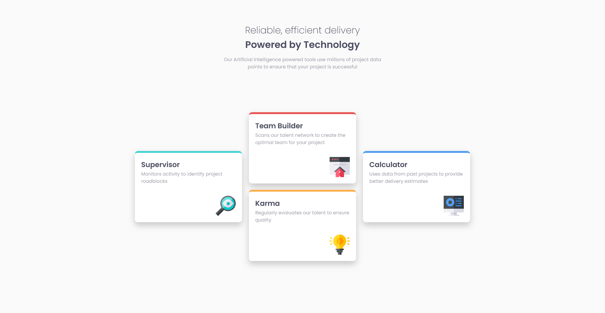

# Frontend Mentor - Four card feature section solution

This is a solution to the [Four card feature section challenge on Frontend Mentor](https://www.frontendmentor.io/challenges/four-card-feature-section-weK1eFYK). Frontend Mentor challenges help you improve your coding skills by building realistic projects.

## Table of contents

- [Overview](#overview)
  - [The challenge](#the-challenge)
  - [Screenshot](#screenshot)
  - [Links](#links)
- [My process](#my-process)
  - [Built with](#built-with)
  - [What I learned](#what-i-learned)
  - [Continued development](#continued-development)
  - [Useful resources](#useful-resources)
- [Author](#author)

**Note: Delete this note and update the table of contents based on what sections you keep.**

## Overview

### The challenge

Users should be able to:

- View the optimal layout for the site depending on their device's screen size

### Screenshot

### Links

- [Solution URL](https://github.com/imandreans/four-card-feature-section-master/)
- [Live Site URL](https://imandreans.github.io/four-card-feature-section-master/)

## My process

### Built with

- Semantic HTML5 markup
- CSS custom properties
- Flexbox
- CSS Grid

### What I learned

I learned how to use grid layout.

### Continued development

Experiment on the grid layout features.

### Useful resources

- [Grid Garden](https://cssgridgarden.com/) - This website helped me to understand about Grid Layout. It's fun website to learn.

## Author

- Website - [Andrean](https://portfolio-gamma-three-44.vercel.app/)
- Frontend Mentor - [@imandreans](https://www.frontendmentor.io/profile/imandreans)
- Twitter - [@imandreans](https://www.twitter.com/imandreans)
